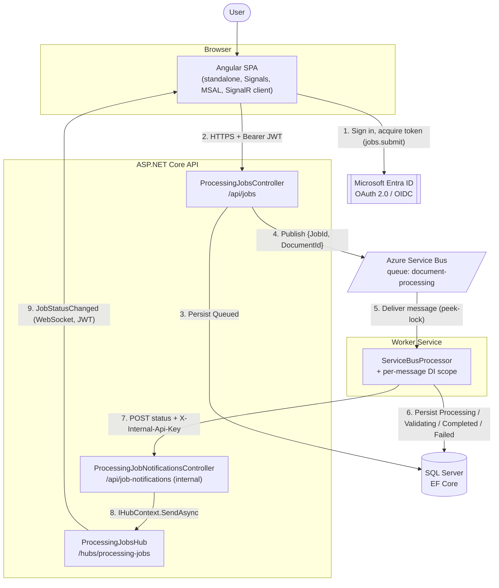
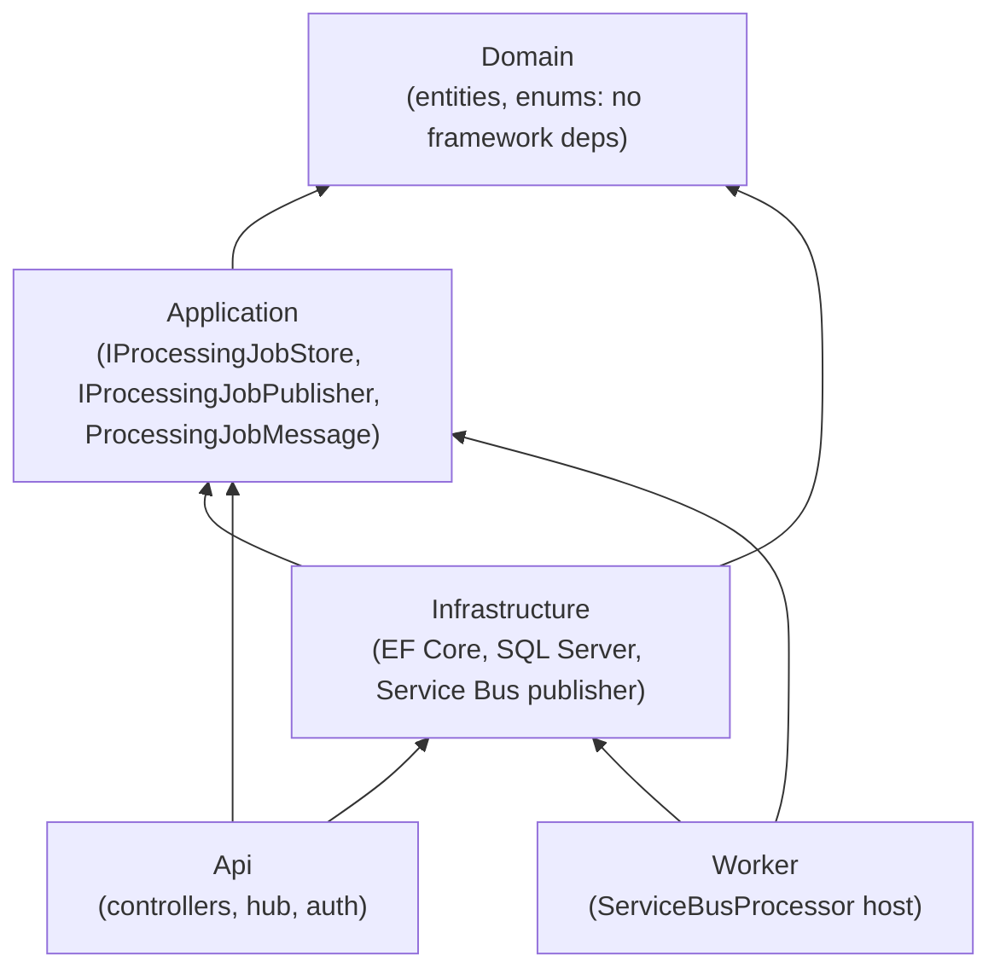
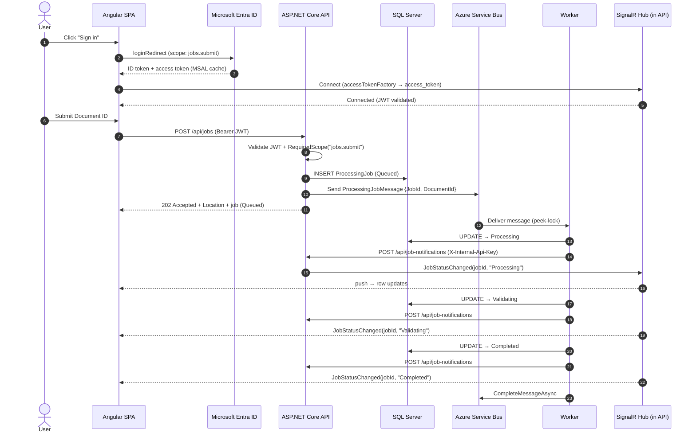
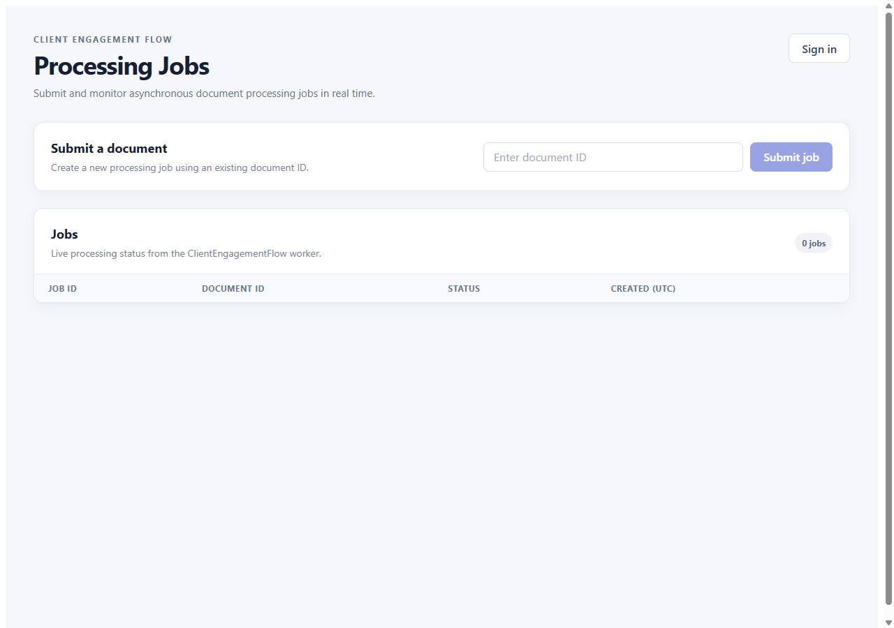
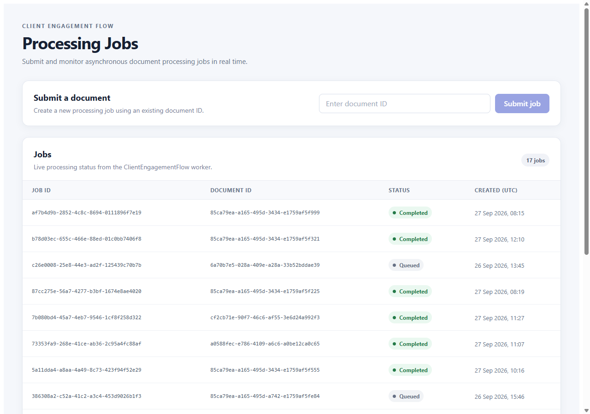
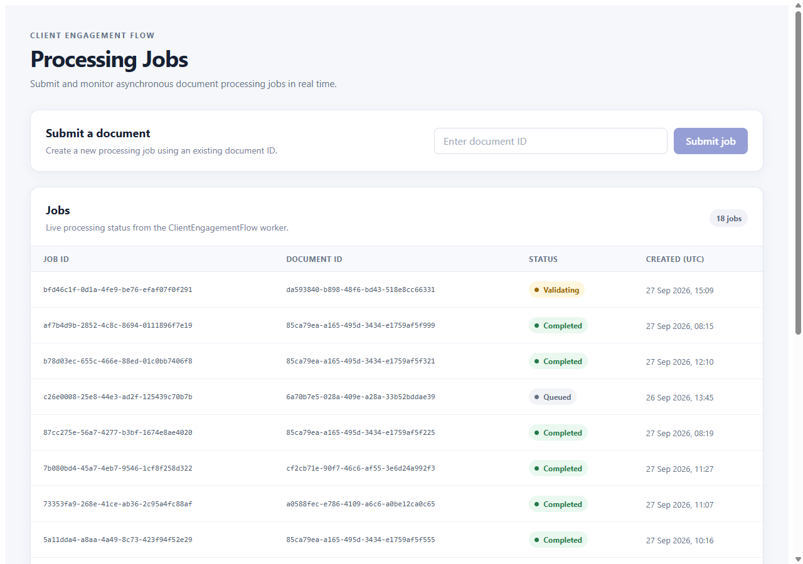
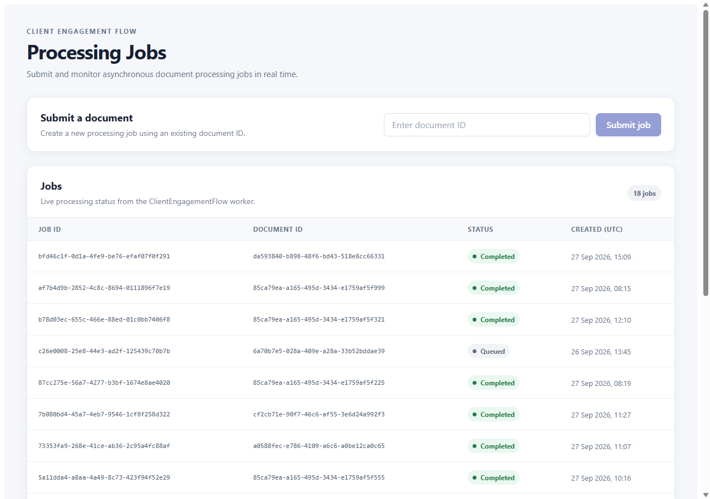
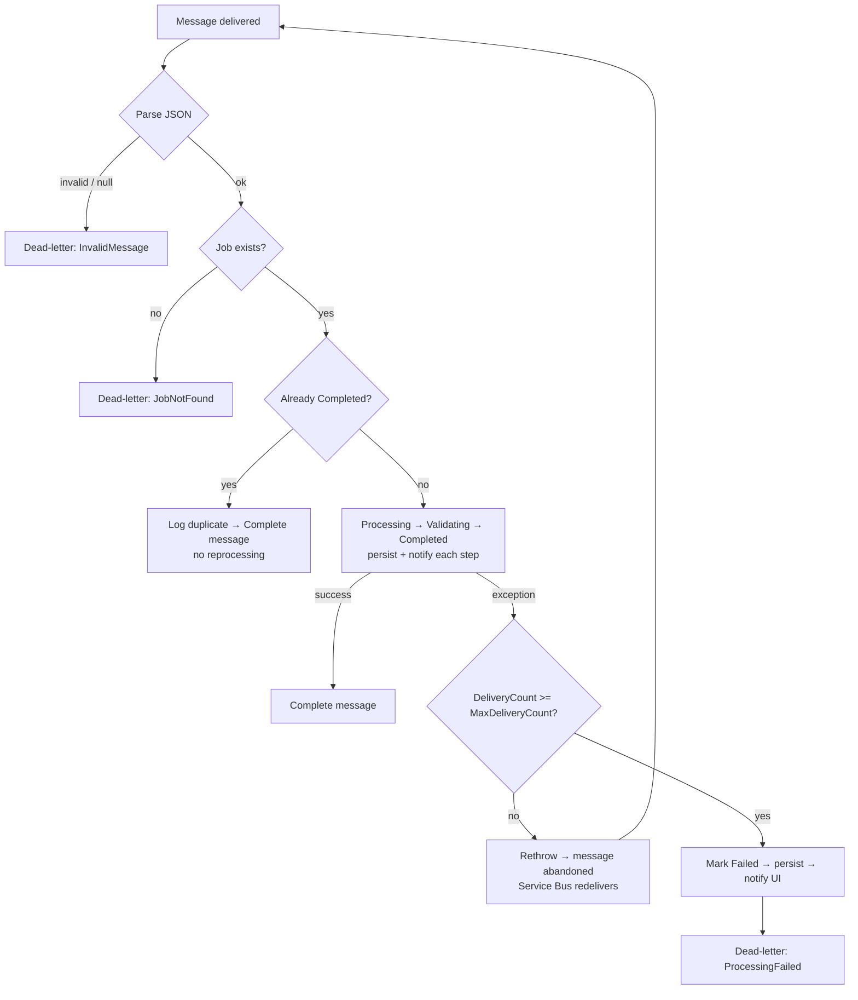

# ClientEngagementFlow

ClientEngagementFlow is a compact reference implementation of an asynchronous enterprise workflow. It covers authentication, messaging, background processing, persistence, reliability patterns and real-time client updates, built with .NET 10, Azure Service Bus, Microsoft Entra ID, SignalR and Angular.

The business domain is deliberately simple, so the architecture, integration boundaries and failure handling stay easy to inspect.

---

## Contents

- [Overview](#overview)
- [Architecture](#architecture)
- [End-to-End Flow](#end-to-end-flow)
- [Application Walkthrough](#application-walkthrough)
- [Solution Structure](#solution-structure)
- [Technology Stack](#technology-stack)
- [Domain Model](#domain-model)
- [API](#api)
- [Authentication & Authorization](#authentication--authorization)
- [Asynchronous Processing](#asynchronous-processing)
- [Reliability: Retries, DLQ & Idempotency](#reliability-retries-dlq--idempotency)
- [Real-Time Updates with SignalR](#real-time-updates-with-signalr)
- [Testing Strategy](#testing-strategy)
- [Configuration & Security](#configuration--security)
- [Known Limitations / Production Improvements](#known-limitations--production-improvements)
- [Running Locally](#running-locally)

---

## Overview

The system models a simplified professional-services document-processing workflow:

1. An authenticated user submits a document for processing.
2. The API creates a `ProcessingJob` in the `Queued` state and returns **`202 Accepted`** immediately, rather than doing the work inside the HTTP request.
3. A background Worker picks the job up from Azure Service Bus and moves it through its lifecycle:

```
Queued → Processing → Validating → Completed
                                 ↘ Failed   (after retries are exhausted)
```

4. Each state change is persisted to SQL Server and pushed to the browser over SignalR, so the dashboard updates without a refresh.

The user supplies a **Document ID** rather than uploading a file. That is a deliberate scope decision: the interesting parts of the system are the boundaries between the API, the queue, the Worker and the client, not file handling. A production approach using Blob Storage is outlined under [Known Limitations](#known-limitations--production-improvements).

---

## Architecture

### High-level system architecture



The key point is that **SQL Server is the source of truth**. Service Bus carries *work to be done*, and SignalR carries *notifications that something changed*. If a notification is lost, the UI still shows the correct state after a reload, because it reads from the API and SQL.

### Project dependency direction



`Domain` has no package references at all: no EF Core, no Azure SDK, no ASP.NET. `Application` references only `Domain` and defines the abstractions the hosts depend on. `Infrastructure` implements them. The two host projects (API and Worker) reference `Infrastructure` only as their composition root, via `AddInfrastructure(...)`.

---

## End-to-End Flow

1. The user signs in through Microsoft Entra ID, using MSAL in the Angular SPA with a redirect flow.
2. Angular acquires an access token for the API's delegated scope `jobs.submit`.
3. Angular submits a Document ID to `POST /api/jobs`. The MSAL interceptor attaches the bearer token.
4. The API validates the JWT through Microsoft.Identity.Web, and `[RequiredScope("jobs.submit")]` checks the scope.
5. A `ProcessingJob` is created and persisted as `Queued`.
6. A `ProcessingJobMessage { JobId, DocumentId }` is published to the `document-processing` queue.
7. The API returns `202 Accepted` with a `Location` header pointing to `GET /api/jobs/{id}`.
8. The Worker's `ServiceBusProcessor` receives the message and opens a new DI scope for it.
9. The job moves to `Processing`, then `Validating`.
10. Each state change is saved to SQL Server.
11. After each change, the Worker calls the API's internal notification endpoint.
12. The API broadcasts `JobStatusChanged(jobId, status)` through SignalR.
13. Angular updates the matching row in its signal-backed job list.
14. The job reaches `Completed`, or `Failed` once delivery attempts are exhausted, and the Worker settles the Service Bus message explicitly.



---

## Application Walkthrough

These screenshots were captured from the running system: the Angular SPA, the API and the Worker, against a real Entra tenant, Service Bus namespace and LocalDB. The Microsoft sign-in page is intentionally not shown.

**Signed out.** The Sign in button is visible, and no protected API calls or SignalR connection are made until the user authenticates.



**Signed in.** Jobs are loaded from `GET /api/jobs` using the MSAL-acquired bearer token, and the SignalR connection is open.



**Job submitted → Processing.** `POST /api/jobs` returned `202` with the job in `Queued`. The Worker picked the message up almost immediately, so by the time of the capture, SignalR had already pushed the `Processing` state.


**Validating.** About 5 seconds later (the simulated delay), the Worker persists `Validating` and the row updates through `JobStatusChanged`.



**Completed.** The row reaches `Completed`. The page was not refreshed at any point between these screenshots.



---

## Solution Structure

The solution file (`ClientEngagementFlow.slnx`) groups the projects into `src` and `tests` **solution folders**. On disk, the projects sit side by side at the repository root.

```
ClientEngagementFlow.slnx
│
├── src
│   ├── ClientEngagementFlow.Api             ASP.NET Core API, SignalR hub, Entra JWT auth, CORS
│   ├── ClientEngagementFlow.Application     Abstractions: IProcessingJobStore, IProcessingJobPublisher, ProcessingJobMessage
│   ├── ClientEngagementFlow.Domain          Entities (ProcessingJob, Document, Engagement) and ProcessingStatus
│   ├── ClientEngagementFlow.Infrastructure  EF Core DbContext, migrations, EF store, Service Bus publisher, DI wiring
│   ├── ClientEngagementFlow.Worker          .NET Worker Service hosting the ServiceBusProcessor
│   ├── ClientEngagementFlow.Web             Angular 21 standalone SPA (MSAL + SignalR)
│   └── ClientEngagementFlow.AuthTest        Console client for validating delegated auth via device-code flow
│
└── tests
    ├── ClientEngagementFlow.Api.Tests       API integration tests (WebApplicationFactory + SQLite in-memory)
    └── ClientEngagementFlow.Domain.Tests    Domain state-transition unit tests
```

---

## Technology Stack

| Area | Technology |
|---|---|
| Runtime | .NET 10 |
| API | ASP.NET Core (controllers), OpenAPI + Scalar (Development only) |
| Identity | Microsoft Entra ID, Microsoft.Identity.Web (API), MSAL Angular / MSAL Browser (SPA), MSAL.NET (AuthTest) |
| Messaging | Azure Service Bus (`Azure.Messaging.ServiceBus`), queue `document-processing` |
| Background processing | .NET Worker Service + `ServiceBusProcessor` |
| Persistence | Entity Framework Core 10, SQL Server (LocalDB for development) |
| Real-time | ASP.NET Core SignalR, `@microsoft/signalr` |
| Frontend | Angular 21 (standalone components, Signals, `bootstrapApplication`, `provideHttpClient`) |
| Testing | xUnit, `WebApplicationFactory<Program>`, SQLite in-memory, custom test authentication handler |

---

## Domain Model

| Concept | Purpose |
|---|---|
| `ProcessingJob` | The unit of asynchronous work and its lifecycle |
| `ProcessingStatus` | `Queued`, `Processing`, `Validating`, `Completed`, `Failed` |
| `Document` | A document belonging to an engagement (file name, content type, upload time) |
| `Engagement` | A client engagement (client name, engagement name) |

`ProcessingJob` holds its own behaviour rather than being a plain property bag:

```csharp
job.StartProcessing();   // Queued      → Processing   (sets StartedUtc)
job.StartValidation();   // Processing  → Validating
job.Complete();          // Validating  → Completed    (sets CompletedUtc)
job.Fail(reason);        // any non-Completed → Failed (reason required)
```

Invalid transitions throw `InvalidOperationException`. For example, a job cannot jump from `Queued` to `Completed`, and a `Completed` job cannot fail. Entities use GUID identifiers, private setters, a private parameterless constructor for EF Core, and UTC timestamps.

The design borrows the useful parts of DDD, such as encapsulated behaviour and guarded state transitions, without aggregate or repository machinery the domain doesn't need.

> `Document` and `Engagement` are modelled and mapped in the `DbContext`, but they are **not yet linked** to `ProcessingJob`. A job currently stores a `DocumentId` GUID, and nothing checks that GUID against the `Documents` table.

---

## API

| Method | Route | Auth | Purpose |
|---|---|---|---|
| `POST` | `/api/jobs` | Bearer + `jobs.submit` scope | Create a job and enqueue it; returns **202** |
| `GET` | `/api/jobs` | Bearer | List jobs |
| `GET` | `/api/jobs/{id}` | Bearer | Get one job (**404** if unknown) |
| `GET` | `/api/jobs/me` | Bearer | Diagnostic: the caller's name and token claims |
| `GET` | `/api/jobs/health` | Anonymous | Simple liveness response |
| `POST` | `/api/job-notifications` | `X-Internal-Api-Key` | Internal: the Worker reports status changes |
| WS | `/hubs/processing-jobs` | Bearer (query string for WebSockets) | SignalR hub |

**Why `202 Accepted`?** When `POST /api/jobs` returns, the processing has not happened yet. `201 Created` or `200 OK` would suggest the work is done. `202` means *the request was accepted for processing*, and the `Location` header (produced by `AcceptedAtAction`) gives the client a resource it can poll. In this system, the client can also get changes pushed to it over SignalR.

The controllers return API contracts (`ProcessingJobResponse`, `CreateProcessingJobRequest`) rather than Domain entities, so the persistence model and the wire format can change independently. Enums are serialized as strings (`JsonStringEnumConverter`), so clients see `"Queued"` rather than `0`.

### Persistence

`IProcessingJobStore` (Application) is implemented by `EfProcessingJobStore` (Infrastructure) on top of `ApplicationDbContext` and SQL Server.

- `GetAllAsync` uses `AsNoTracking()` because it is a read-only projection.
- `GetByIdAsync` is deliberately **tracked**, because the Worker loads a job, calls domain methods on it and saves the changes.
- The schema is managed through EF Core migrations (`InitialCreate`).

---

## Authentication & Authorization

The system uses Microsoft Entra ID instead of custom identity. There are three app registrations:

| Registration | Role |
|---|---|
| **ClientEngagementFlow API** | Protected resource. Exposes the delegated scope `api://<api-client-id>/jobs.submit`. |
| **Angular SPA** | Public client (SPA platform, redirect URI `http://localhost:49860`). Requests `jobs.submit` for the signed-in user. |
| **AuthTest client** | Public client used with the device-code flow to get tokens and check the API independently of the UI. |

The four concerns are separate and each lives in one place:

- **Authentication** (who is the caller?): Entra signs the user in, and the API's JWT bearer handler (`AddMicrosoftIdentityWebApi`) checks the token's signature, issuer, audience and lifetime. An invalid or missing token results in `401`.
- **Authorization** (what may the caller do?): `[Authorize]` on `ProcessingJobsController` and `ProcessingJobsHub` requires an authenticated caller.
- **Delegated scopes:** `jobs.submit` means *this app may submit jobs on behalf of this user*. The SPA asks for it at sign-in and the user (or an admin) consents.
- **API-side enforcement:** the API never trusts the client's own view of its permissions. `[RequiredScope("jobs.submit")]` on `POST /api/jobs` checks the `scp` claim in the validated token. A valid token without the scope results in `403`.

In the SPA, `MsalInterceptor` is registered with a protected-resource map for `{apiBaseUrl}/api/jobs`, so API calls get bearer tokens without any per-request code. Sign-in is an explicit user action, and the SPA only loads jobs and opens the SignalR connection once there is an active MSAL account. After a redirect, the active account is restored from `handleRedirectObservable()` or the MSAL cache.

---

## Asynchronous Processing

### Publishing

`POST /api/jobs` persists the job and then publishes a small message:

```json
{ "JobId": "…", "DocumentId": "…" }
```

The message carries identifiers only, never document content. `MessageId` is set to the job ID and `ContentType` to `application/json`.

### Consuming

The Worker is a .NET Worker Service (`BackgroundService`) that uses **`ServiceBusProcessor`**. It does not run a hand-written `ReceiveMessageAsync` polling loop, because the processor handles concurrency, lock renewal and the receive loop itself.

```csharp
_processor = _serviceBusClient.CreateProcessor(queueName, new ServiceBusProcessorOptions
{
    AutoCompleteMessages = false   // settlement is explicit
});
```

With `AutoCompleteMessages = false`, a message is only removed from the queue when the code explicitly calls `CompleteMessageAsync` or `DeadLetterMessageAsync`. This gives **at-least-once** processing: a crash mid-processing leaves the message locked, and it is redelivered once the lock expires.

### Simulated work

There is no real document-processing logic. Between `Processing`, `Validating` and `Completed`, the Worker waits for a **fixed 5-second `Task.Delay`** so the asynchronous, real-time behaviour can be seen in the UI. This is demo behaviour and would be replaced by real processing steps. The delay is currently hard-coded in `Worker.cs`, not read from configuration.

---

## Reliability: Retries, DLQ & Idempotency

The Worker handles Service Bus delivery semantics explicitly rather than relying on the defaults.

| Situation | Behaviour | DLQ reason |
|---|---|---|
| Body is not valid JSON | Dead-lettered immediately; retrying cannot fix it | `InvalidMessage` |
| Body deserializes to `null` | Dead-lettered immediately | `InvalidMessage` |
| `JobId` not found in SQL | Dead-lettered immediately | `JobNotFound` |
| Job already `Completed` (duplicate delivery) | Logged, message **completed**, no reprocessing | — |
| Unexpected exception, attempts remaining | Exception rethrown, message not settled, **Service Bus redelivers it** | — |
| Unexpected exception on the final attempt (`DeliveryCount >= MaxDeliveryCount`) | Job marked `Failed` → persisted → UI notified → dead-lettered | `ProcessingFailed` |

The Worker does **not** mark a job `Failed` on its first exception, because a later delivery might still succeed. `Failed` is only set once the configured `ServiceBus:MaxDeliveryCount` (default `10`) is reached. That setting must match the queue's own *Max Delivery Count* in Azure.



### Idempotency

The idempotency guard is **deliberately basic**. The scenario it protects against is:

```
Worker saves Completed to SQL  ✔
Worker calls CompleteMessageAsync  ✘ (lock lost / network blip)
→ Service Bus redelivers the message
→ Worker sees the job is already Completed
→ completes the duplicate message without re-running the work
```

This is **not** exactly-once processing. The guard only recognises the `Completed` state, and concurrency across several Worker instances relies on Service Bus peek-lock rather than on optimistic concurrency in the database.

> **Known retry limitation.** Retries only fully recover if the failure happens *before* the first state change is persisted. If an exception is thrown after the job has been saved as `Processing` or `Validating`, the redelivered message calls `StartProcessing()` on a job that is no longer `Queued`. The domain guard rejects that, so each retry fails the same way until the final attempt marks the job `Failed`. Making retries resumable is one of the improvements listed below.

### Notification failures are isolated from processing

Real-time notification is **best-effort**. `NotifyStatusChangedSafelyAsync` wraps the HTTP call to the API, logs a warning on failure and swallows the exception:

- A failed UI notification **never** causes a Service Bus retry of work that already succeeded.
- The job's state in SQL is still correct, and the message is still completed.
- A client that missed the push sees the correct status the next time it loads from the API.

SQL is the source of truth, and SignalR is a hint that something changed.

---

## Real-Time Updates with SignalR

### Connection and authentication

The API hosts `ProcessingJobsHub` at `/hubs/processing-jobs`, protected with `[Authorize]`.

Browsers cannot set an `Authorization` header on a WebSocket upgrade request. The SignalR client therefore sends the token as an `access_token` query-string parameter, which it gets from `accessTokenFactory`. In the Angular client, that factory calls MSAL's `acquireTokenSilent` for the `jobs.submit` scope.

On the API side, `JwtBearerOptions.Events.OnMessageReceived` is extended rather than replaced:

1. Any handler that Microsoft.Identity.Web already registered runs first.
2. If no token has been found yet **and** the request path starts with `/hubs/processing-jobs`, the query-string token is used.
3. Normal JWT validation then runs as it does for any other request.

The token extraction is limited to the hub path, so the rest of the API never accepts tokens from the query string.

### Worker → API → client

The Worker and the API are **separate processes**, so the Worker has no access to the API's `IHubContext`. The notification path is:

```
Worker ──HTTP POST /api/job-notifications──▶ API ──IHubContext──▶ ProcessingJobsHub ──WebSocket──▶ Angular
          (X-Internal-Api-Key header)
```

The internal endpoint checks a shared key sent in the `X-Internal-Api-Key` header and returns `401` if the key is missing or wrong. It is marked `[AllowAnonymous]` because it does not use user JWTs. This is a deliberately simple service-to-service mechanism for the current scope; in production it would be replaced by Entra app-to-app auth or Managed Identity.

The API then broadcasts `JobStatusChanged(jobId, status)`. Angular's `ProcessingJobsHubService` subscribes to that event, and the component updates the matching row in its `jobs` signal. The row moves through `Processing → Validating → Completed` without a page refresh.

> Broadcasts currently go to `Clients.All`, so every connected, authenticated client receives every job's events. See [Known Limitations](#known-limitations--production-improvements).

---

## Testing Strategy

### Domain tests (`ClientEngagementFlow.Domain.Tests`)

These are pure unit tests of the `ProcessingJob` state machine:

- a new job is `Queued`
- a job can move through the full valid lifecycle
- a `Queued` job cannot complete directly
- a `Completed` job cannot fail
- failing requires a reason

### API integration tests (`ClientEngagementFlow.Api.Tests`)

These tests host the real API pipeline in memory with `WebApplicationFactory<Program>`: routing, model binding, filters, authorization and JSON serialization. They swap out two dependencies:

- **Database:** SQL Server is replaced by **SQLite in-memory**, with a fresh connection and schema per test context.
- **Authentication:** Entra JWT validation is replaced by a `TestAuthHandler`. Test headers such as `X-Test-Anonymous` and `X-Test-Scopes` control the principal and its `scp` claim, so the tests cover real `[Authorize]` and `[RequiredScope]` behaviour without live tokens.

| Scenario | Expected |
|---|---|
| POST valid job | `202 Accepted` |
| POST returns job in `Queued` state | ✔ |
| POST sets `Location` header | ✔ |
| GET existing job | `200` |
| GET unknown job | `404` |
| GET all (with and without jobs) | ✔ |
| POST with empty `DocumentId` | `400` |
| GET without authentication | `401` |
| POST without authentication | `401` |
| POST authenticated without `jobs.submit` | `403` |
| Health endpoint anonymously | `200` |

**Why SQLite in-memory rather than EF Core InMemory?** The EF InMemory provider is not relational: it doesn't enforce constraints, doesn't translate queries to SQL and doesn't behave like a real database with transactions. SQLite in-memory is still fast and isolated per test, but it is a real relational engine, so mapping, constraint and query-translation problems show up. It is **not** SQL Server, though: type mapping, collation, concurrency and some SQL features differ. SQL Server in Testcontainers would be the higher-fidelity next step.

> The API tests currently register the real `ServiceBusProcessingJobPublisher`, so the `POST` tests send messages to the configured Service Bus queue. Replacing the publisher with a test double in `ApiTestContext` would make the suite fully self-contained.

---

## Configuration & Security

### Configuration

Environment-specific values live in configuration, not in code.

| Setting | Where |
|---|---|
| API base URL, SignalR hub URL, Entra tenant ID, SPA client ID, API scope, redirect URI | `ClientEngagementFlow.Web/src/environments/environment.ts` |
| `AzureAd` (instance, tenant, API client ID, audience) | API `appsettings.json` |
| `Cors:AllowedOrigins` | API `appsettings.json` (the app fails at startup if this is missing) |
| `ServiceBus:QueueName`, `ServiceBus:MaxDeliveryCount` | `appsettings.json` |
| `InternalApi:BaseUrl` | Worker `appsettings.json` (the app fails at startup if this is missing) |
| `ConnectionStrings:DefaultConnection` | `appsettings.json` (LocalDB, integrated security, so there's no password) |
| **`ServiceBus:ConnectionString`** | **User secrets / environment variables only** |
| **`InternalApi:NotificationApiKey`** | **User secrets / environment variables only** (the Worker fails at startup if this is missing) |

The Angular `environment.ts` contains only **public** OAuth identifiers (tenant, SPA client ID, scope). SPAs are public clients and must never hold a client secret; this one doesn't.

### Security summary

- **Identity:** Microsoft Entra ID, with OAuth 2.0 / OIDC through MSAL.
- **API:** JWT bearer validation through Microsoft.Identity.Web. `[Authorize]` applies at controller level, and `[RequiredScope("jobs.submit")]` protects job submission.
- **SignalR:** the hub is `[Authorize]`, and query-string tokens are accepted **only** on the hub path.
- **CORS:** explicit origins from configuration. `AllowCredentials()` is only combined with those explicit origins, never with a wildcard.
- **Service-to-service:** the Worker → API notification uses a shared key held in secrets. It is suitable for development, not the final design.
- **Secrets:** none are committed. Local development uses `dotnet user-secrets`, and deployed environments would use platform configuration or Key Vault.
- **Least privilege (intended):** in production, `RootManageSharedAccessKey` would not be used. The API would get **Azure Service Bus Data Sender** and the Worker **Azure Service Bus Data Receiver**, both through Managed Identity, which would remove connection strings entirely.

This is a sensible baseline for the current scope, not a finished production security posture. See below.

---

## Known Limitations / Production Improvements

These are understood gaps, deliberately outside the current scope.

### SQL + Service Bus consistency gap (Transactional Outbox)
`POST /api/jobs` does two separate writes:

```
1. SaveChanges → ProcessingJob (Queued) in SQL   ✔
2. SendMessage → Service Bus                      ✘ (e.g. transient network failure)
```

If step 2 fails, the job stays `Queued` for ever, with no message to process it. **There is no atomic transaction across SQL Server and Service Bus.** The production fix is the **Transactional Outbox** pattern:

1. Write the job and an `OutboxMessage` row in the same SQL transaction.
2. A relay publishes pending outbox rows to Service Bus and marks them as sent.
3. Consumers stay idempotent, because the relay can publish more than once.

### Other improvements
- **Blob Storage for real documents.** File bytes do not belong in queue messages. The flow would be: upload to Blob Storage → persist document and blob metadata → the message carries `JobId`, `DocumentId` and the blob reference → the Worker streams the blob.
- **Link `Document` and `Engagement` to jobs**, and check that a submitted `DocumentId` exists and belongs to an engagement the user can access.
- **Per-engagement authorization and SignalR groups.** At the moment, any authenticated user can list all jobs and receives every `JobStatusChanged` broadcast. A multi-tenant design would authorize the user against an engagement, add their connection to an engagement-specific group and broadcast only to that group.
- **Managed Identity** for Service Bus and SQL, plus Entra app-to-app auth or Managed Identity for Worker → API calls, replacing connection strings and the shared API key.
- **Azure Key Vault** for any remaining secrets.
- **Observability:** Application Insights and OpenTelemetry, with correlation IDs carried from HTTP → Service Bus (`CorrelationId` / application properties) → Worker → notification → SignalR.
- **Stronger idempotency and concurrency:** processed-message tracking, optimistic concurrency (a rowversion column) on `ProcessingJob`, and resumable processing so a retry can continue from `Processing` or `Validating`.
- **Replace the simulated delays** with real processing steps.
- **Test isolation:** use a test double for the publisher in the API tests, and consider SQL Server Testcontainers.
- **Deployment:** infrastructure as code (Bicep or Terraform) and CI/CD. Nothing has been deployed yet.

---

## Running Locally

### Prerequisites

- **.NET 10 SDK**
- **Node.js** (22.x used in development) and **npm** (the project pins `npm@10.9.3` via `packageManager`)
- **SQL Server LocalDB** (installed with Visual Studio), or change `ConnectionStrings:DefaultConnection` to point at another SQL Server
- An **Azure Service Bus** namespace with a queue named `document-processing` (Max Delivery Count should match `ServiceBus:MaxDeliveryCount`, default 10)
- A **Microsoft Entra ID** tenant with:
  - an API app registration exposing the scope `jobs.submit`
  - a SPA app registration with redirect URI `http://localhost:49860` and delegated permission to `jobs.submit`
- The **ASP.NET Core HTTPS development certificate** (`dotnet dev-certs https --trust`)

### 1. Configure identifiers

- **API:** set `AzureAd:TenantId`, `AzureAd:ClientId` and `AzureAd:Audience` in `ClientEngagementFlow.Api/appsettings.json`.
- **SPA:** set the tenant ID, SPA client ID, API client ID and `apiScope` in `ClientEngagementFlow.Web/src/environments/environment.ts`.

### 2. Configure secrets

Run these from the repository root. Use the **same** notification key for both projects.

```bash
dotnet user-secrets set "ServiceBus:ConnectionString" "<service-bus-connection-string>" --project ClientEngagementFlow.Api
dotnet user-secrets set "ServiceBus:ConnectionString" "<service-bus-connection-string>" --project ClientEngagementFlow.Worker

dotnet user-secrets set "InternalApi:NotificationApiKey" "<random-shared-key>" --project ClientEngagementFlow.Api
dotnet user-secrets set "InternalApi:NotificationApiKey" "<random-shared-key>" --project ClientEngagementFlow.Worker
```

### 3. Create the database

The application does not run migrations on startup. Apply them with the EF Core CLI:

```bash
dotnet tool install --global dotnet-ef
dotnet ef database update --project ClientEngagementFlow.Infrastructure --startup-project ClientEngagementFlow.Api
```

### 4. Run

Run each of these in its own terminal:

```bash
# API: https://localhost:7221 (Scalar UI at /scalar in Development)
dotnet run --project ClientEngagementFlow.Api --launch-profile https

# Worker
dotnet run --project ClientEngagementFlow.Worker

# Angular SPA: http://localhost:49860
cd ClientEngagementFlow.Web
npm install
npm start
```

Open `http://localhost:49860`, sign in, and submit a Document ID. It must be a non-empty GUID, for example one generated with `[guid]::NewGuid()` or `uuidgen`.

In Visual Studio, you can instead set **API**, **Worker** and **Web** as multiple startup projects.

### 5. Test

```bash
dotnet test
```

The API integration tests use SQLite and a test authentication handler, so they don't need Entra or SQL Server. They **do** need the API's Service Bus user secret, because the real publisher is still registered (see above).
